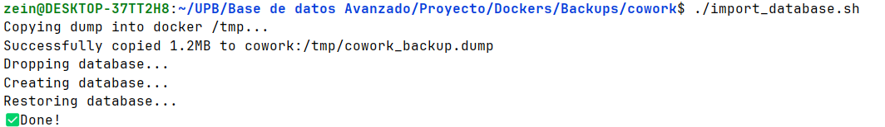

# Cowork de Cocinas

El Mortero es un cowork de cocinas creado para apoyar a emprendedores gastronómicos que no cuentan con un espacio propio para trabajar. Tras su éxito en La Paz y su expansión a Cochabamba y al resto de ciudades de Bolivia, el aumento de usuarios expuso fallas en su sistema de gestión, como reservas duplicadas, equipos en mal estado y desorganización con proveedores.

Este proyecto busca solucionar estos problemas mediante un sistema que gestione eficientemente las reservas, el mantenimiento de equipos y la administración de recursos, mejorando así la operación del negocio y el servicio a sus usuarios.

### 0.  Pre-requisitos

Para ejecutar este proyecto, es necesario tener instalado lo siguiente:

- Python 3.10+
- Node.js 18+
- Docker y Docker Compose
### 1. Clonar Repositorio
Clonar la rama main del repositorio con:
````
git clone https://github.com/ZeinTonconi/Proyecto-Final-BD-Avanzadas.git
````
### 2. Dependencias de Python
Si opta por crear un entorno virtual de python lo puede hacer de la siguiente forma:
```
python -m venv venv
source venv/bin/activate
```

Para instalar las dependencias de python debe utilizar el siguiente comando:
```
pip install -r requirements.txt
```

### 3. Inicializacion de las Base de Datos 
Dentro de la carpeta /Cowork ejecutar:
```
docker-compose up -d
```
Esto levantara las bases de datos: cowork (PostgreSQL), organization (MariaDB) y stationdb (MongoDB)

Una vez levantado el docker debe ejecutar el script *import_database.sh* para importar
el backup de la base de datos cowork.
```
cd ./Backups/cowork
chmod +x import_database.sh
./import_database.sh
```

Luego ir a la carpeta organization y recuperar el backup
```
cd ../organization

docker exec -i organization   sh -c 'exec mysql -u root -p"admin123" organization'   < organization_bakcup.sql
```
Luego ir a la carpeta Mongo y ejecutar el cambio de permisos (por si es requerido) y el script para importar los datos:
````
cd ../Mongo
chmod +x import_mongo.sh
./import_mongo.sh
````
Finalmente ir a la carpeta Centralizado y ejecutar el cambio de permisos (por si es requerido) y el script para importar los datos:
````
cd ../Centralizado
chmod +x import_mongo.sh
./import_centralizado.sh
````

### SP, Vistas, Triggers, Funciones y Particiones
Primero se debe crear una conexion a MariaDB y a postgres con los siguientes credenciales:

- **Postgres**
  - user: admin
  - password: admin
- **MariaDB**
  - user: admin
  - password: admin
- **MongoDB**
  - user: admin
  - password: secret

* Todas las consultas de PostgreSQL estan dentro de la carpeta "/SQLs/PostgresSQL (cowork)" en el archivo cowork.sql  Los ejemplos de ejecucion de las vistas, SP, triggers, funciones y de las particiones se encuentran en la dentro de la misma carpeta en el archivo examples.sql
* Todas las consultas de MariaDB estan dentro de la carpeta "/SQLs/MariaDB (organization)" en el archivo organization.sql  Los ejemplos de ejecucion de las vistas, SP, triggers, funciones y de las particiones se encuentran en la dentro de la misma carpeta en el archivo examples.sql 

### Backups
Para realizar backups se debe usar los siguientes comandos:
* PostgresSQL: Se guardara en la carpeta de postgres por temas de permisos
  ```
  docker exec -u postgres cowork pg_dump -U admin -d cowork -Fc -f /var/lib/postgresql/cowork_backup.dump
  docker cp cowork:/var/lib/postgresql/cowork_backup.dump ./cowork_backup.dump
  ```
* MariaDB
    ```
    docker exec mariadb-container \
  sh -c 'exec mysqldump -u root -p"admin123" \
    --routines --single-transaction --quick --lock-tables=false organization' \
  > organization_backup.sql
  ```
* Mongo (Genera dentro del contenedor)
    ```
    docker exec -it stationdb mongodump --authenticationDatabase admin -u admin -p secret --db information --out /tmp/mongo_backup
  ```
  ```
    docker exec -it stationdb mongodump --authenticationDatabase admin -u admin -p secret --db cowork_central --out /tmp/mongo_sqlynosql_backup
  ```
  
### MongoDB
Partiendo de la raiz, dentro de la carpeta /MongoDB existen dos archivos:
* *data.sql*: donde estan todos los documentos.
* *queries.sql*: en este archivo se encuentran todas las consultas que se realizo.

### Cache
Para la demostracion del cache debe ingresar dentro de la carpeta /cache desde la raiz, y levantar el docker con:
```
cd ./cache/
docker-compose up -d
npm i
```
Y luego ejecutar el archivo cache.js con:
```
  node cache.js
```
Y por consola se mostrara que el usuario fue llamado una vez a la BD y luego Redis se encargo de devolver el registro:

Seguido de los horarios que tienen el mismo comportamiento, primero es llamada a la BD y luego el cache siempre responde sin pedir a la BD. 
### Sharding (La Paz y Cochabamba)
Desde la raiz nos vamos a la carpeta sharding y levantamos el docker:
```
  cd ./sharding
  npm i
  docker-compose up -d
```
Se debe asegurar de que el puerto 5432 este libre si no lo esta debe apagar el programa quien este utilizando ese puerto, 
con la aplicacion grafica de docker puede detener el contenedor que esta utilizando el puerto:

Para luego volver a ejecutar *docker-compose up -d* y ya podra visualizar los shards de La Paz y Cochabamba

Una vez de que el docker este arriba ejecutamos el .js con:
``` 
  node sharding.js
```
En este ejemplo tenemos 3 usuarios de 3 diferentes ciudades:
```
const rebeca = {
  city: 'LP',
  user_id: 1000002,
  first_name: 'Rebeca',
  last_name: 'Navarro',
  business_name: 'Wrebe teas',
  business_type: 1,
  creation_date: '2024-01-10',
  email: 'rebeca@gmail.com',
  phone_number: 123456789,
};
```
```
const hade = {
  city: 'SC',
  user_id: 1000003,
  first_name: 'Hade',
  last_name: 'Villegas',
  business_name: 'Ville guesas',
  business_type: 2,
  creation_date: '2024-03-22',
  email: 'hade@example.com',
  phone_number: 987654321,
};
```
```
const monse = {
  city: 'CBBA',
  user_id: 1000005,
  first_name: 'Monserrat',
  last_name: 'Del Pilar',
  business_name: 'Monse dillas',
  business_type: 3,
  creation_date: '2024-06-17',
  email: 'monse@example.com',
  phone_number: 555555555,
};
```
Cuando ejecutemos el sharding.js en consola tendremos lo siguiente:

Donde se puede ver que esta separndo los datos de La Paz y Cochabamba y cuando recibe un dato que no tiene un shard asigno tambien lo almacena.

### master-slave

### ETL
Debe tener levantado el docker de la carpeta Cowork, como tambien la inicializacion de los datos. Ademas de tener todas las librerias
que estan en *requirements.txt*. Para luego ejecutar el archivo *loading.py*
```
  python ETL/loading.py
```
Y deberia mostrar el siguiente mensaje


Si se va a su aplicacion de gestion de base de datos y se va a diagramas podra ver que la base de datos se creo.


Y tambien dentro de la carpeta ETL hay un archivo *queries.sql* donde estan queries para el snowflake.